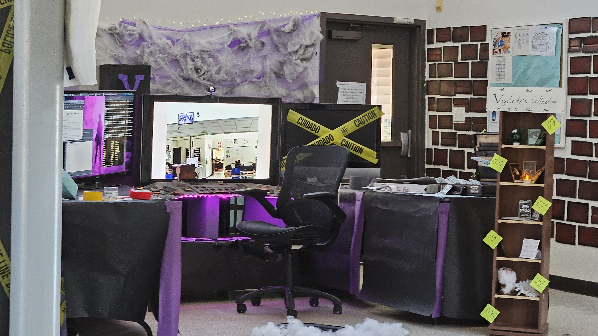
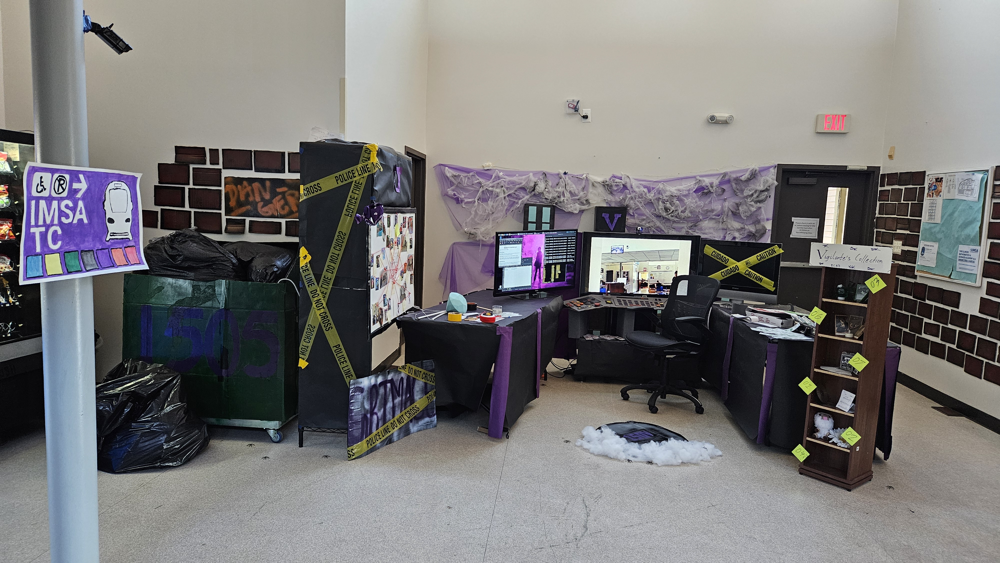
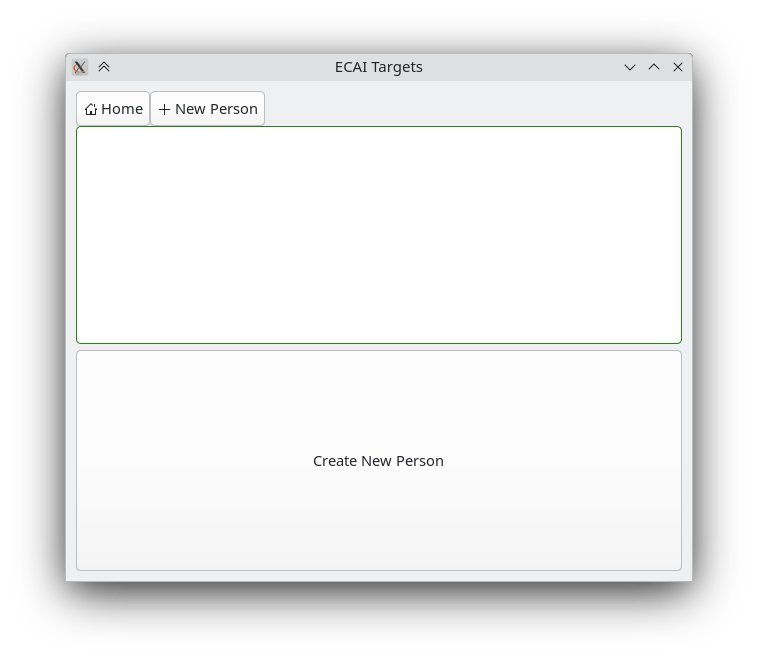
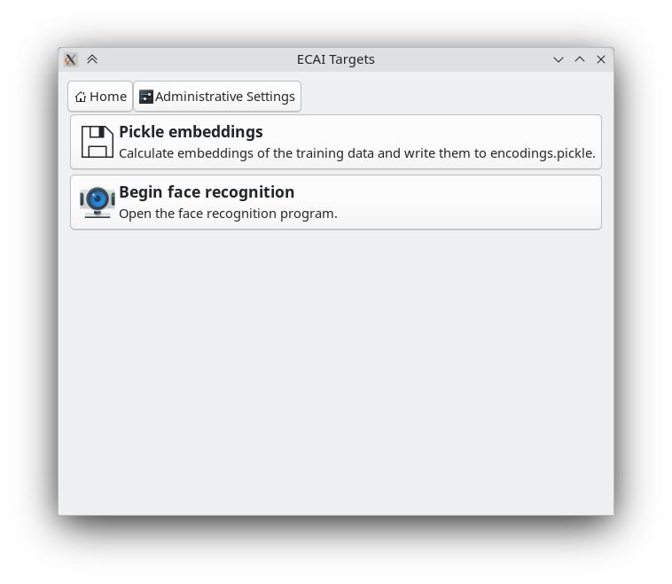

# 2024 Clash of the Halls

<https://github.com/ethanc8/vision05-clean>

Every year, my school has an inter-dorm competition called Clash of the Halls. In this competition, the 7 halls (dorms) compete to win points in multiple different events, including "hall decorations". 

For the year 2024, we decorated the hall under the theme "Vigilante". I made a fake security camera viewer and a document viewer to represent the vigilante's workstation in his hideout.

## The actual application

